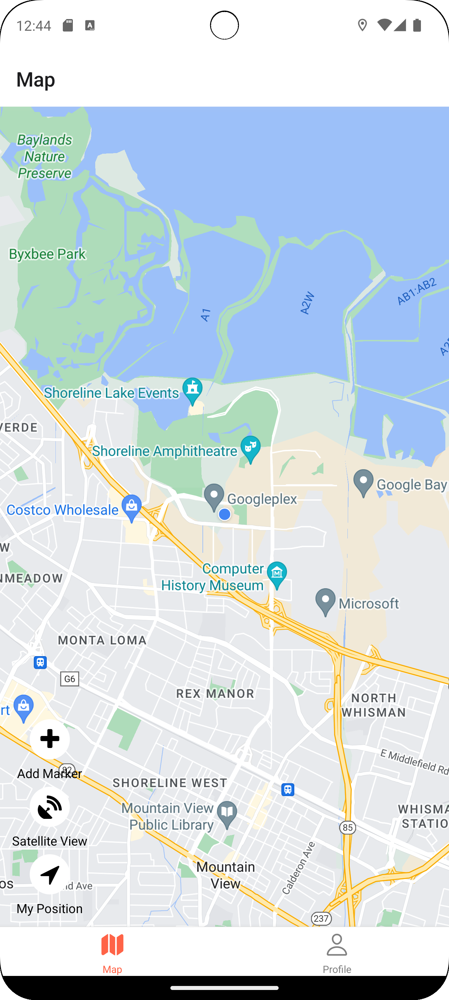
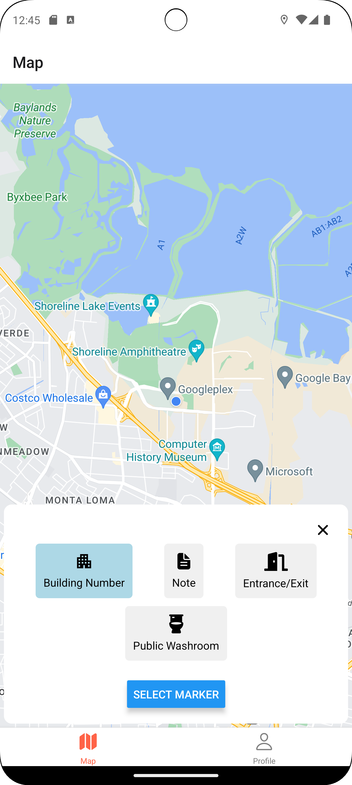
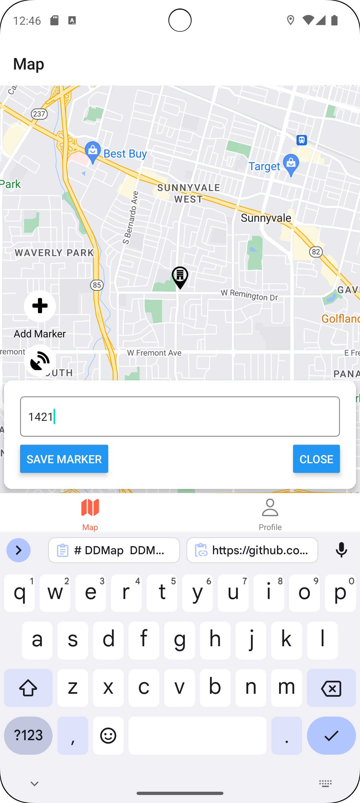
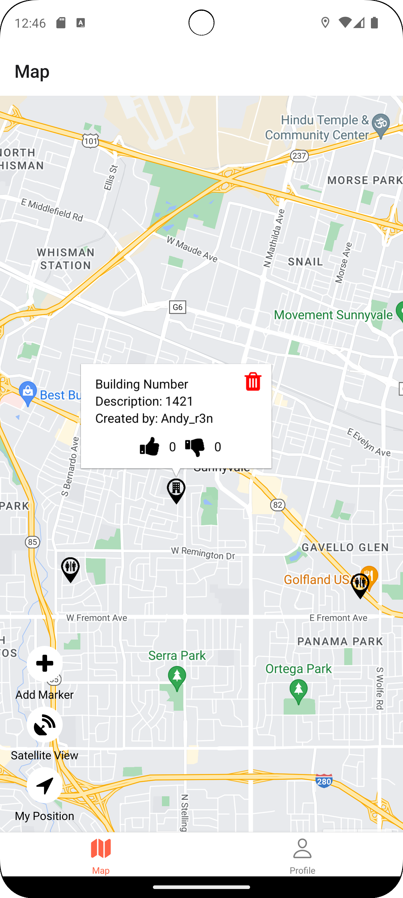
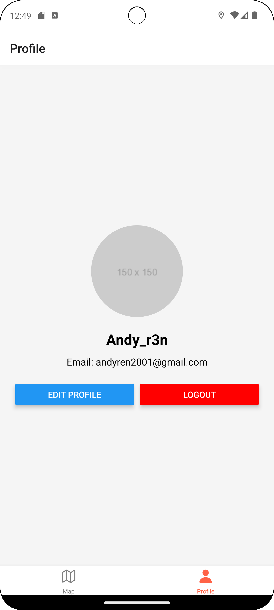

# DDMap

DDMap is a mobile application designed to assist delivery drivers in efficiently marking and sharing important locations such as building numbers, entrances/exits, and public washrooms. The app allows users to add markers, provide descriptions, and rate the usefulness of these markers, helping other drivers navigate their routes more effectively.

## Features

- **Add Markers**: Mark important locations like building numbers, notes, entrances/exits, and public washrooms.
- **Vote on Markers**: Upvote or downvote markers to indicate their usefulness to other drivers.
- **User Authentication**: Secure login and registration using Firebase Authentication.
- **User Profiles**: Manage user profiles with the ability to update display names and profile pictures.
- **Map Types**: Switch between standard and satellite view maps.
- **Geolocation**: Automatically detect and navigate to the user's current location.
- **Interactive Map**: Display markers with detailed information, including descriptions and the username of the creator.
- **Marker Management**: Edit and delete markers as needed.

## Screenshots

### Map View

### Map View (Satellite)

### Marker Selection

### Marker Description Input

### Marker Callouts

### Profile

